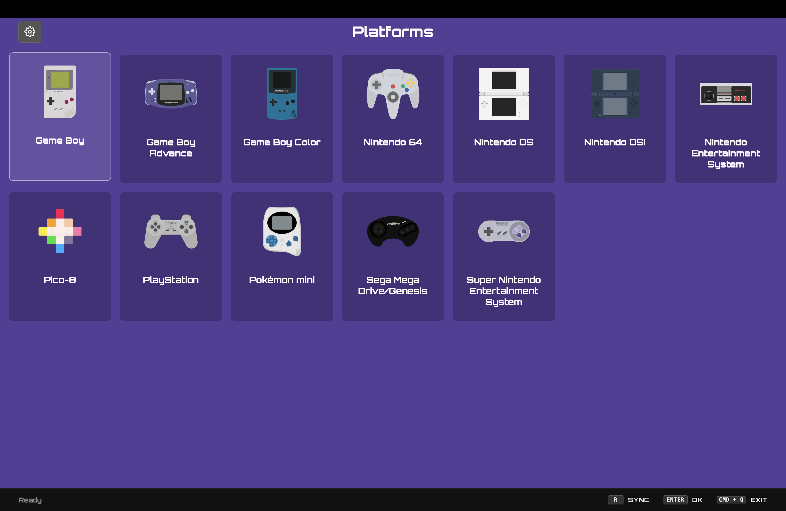
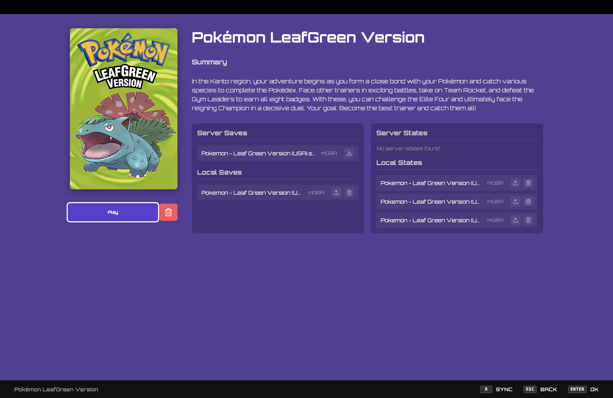

<p align="center">
  
  <br>
  <em>A seamless bridge between RomM and RetroArch for a console-like gaming experience.</em>
</p>

# Go-RomM-Sync

> [!IMPORTANT]
> This application is a client for synchronizing and playing games from your RomM library locally on your device. It is **not** intended for managing or adding new games to your self-hosted RomM instance. Please use the RomM web interface for administrative tasks.
>
> **Note:** This project is not affiliated with, endorsed by, or in any way officially connected with the [RomM project](https://github.com/rommapp/romm).
>
> **Supported RomM Version:** [4.6.1](https://github.com/rommapp/romm/releases/tag/4.6.1)

Go-RomM-Sync is a desktop application built with Wails and React that synchronizes your RomM library with a local RetroArch installation. It provides a gaming-console-like experience with full controller navigation support, making it perfect for use with gamepads on a home theater setup.

## Features

- **Enhanced Metadata**: Fetches detailed game summaries, genres, and cover art directly from your RomM instance.
- **Library Management**: One-click download of ROMs to your local storage, organized by platform.
- **RetroArch Integration**: Launch games directly into RetroArch with automatic core detection and RetroAchievements support.
- **Spatial Navigation**: Full support for gamepad and keyboard navigation, with "sticky" focus that remembers your position as you browse.
- **Cross-Platform**: Designed to work on macOS, Linux, and Windows.

## Screenshots

<p align="center">
  
  <br>
  <em>Platform Selection Screen</em>
</p>

<p align="center">
  
  <br>
  <em>Game Selection for Game Boy Advance</em>
</p>

<p align="center">
  
  <br>
  <em>Game Detail Page with Server and Local Saves</em>
</p>

## Technology Stack

- **Backend**: Go with [Wails v2](https://wails.io/) for native OS integration.
- **Frontend**: React + TypeScript + Vite.
- **Styling**: Vanilla CSS for a lightweight, performant UI.
- **Navigation**: Norigin Spatial Navigation for console-like input handling.

## Development

### Developer Prerequisites

- Go 1.23+ installed on your system.
- Node.js 18+ installed on your system.
- NPM installed on your system.
- Wails cli installed on your system.

### Running Locally

To run the application in development mode with hot reloading:

```bash
wails dev
```

### Building

To build a production-ready package for your current platform:

```bash
wails build
```

#### Linux Specifics

For modern Linux distributions (like Ubuntu 22.04+), you may need to install additional dependencies and use specific build tags:

```bash
# Install dependencies (Ubuntu/Debian)
sudo apt-get install libgtk-3-dev libwebkit2gtk-4.1-dev

# Build with WebKit 4.1 tags
wails build -tags webkit2_41
```

## Installation

### macOS (Homebrew)

The easiest way to install Go-RomM-Sync on macOS is via Homebrew:

```bash
brew tap zapturk/homebrew-tap
brew install --cask go-romm-sync
```

### Windows (Scoop)

If you use [Scoop](https://scoop.sh/), you can install Go-RomM-Sync directly from the manifest in this repository:

```powershell
scoop install https://raw.githubusercontent.com/zapturk/Go-RomM-Sync/main/scoop/go-romm-sync.json
```

### Manual Installation

Alternatively, you can download the latest release for your platform from the [Releases page](https://github.com/zapturk/Go-RomM-Sync/releases) and move the executable to your applications/bin directory.

## Setup and Usage

### First-Time Configuration

1. **Launch**: Open the application.
2. **Authentication**: Enter your RomM host URL (e.g., `https://romm.example.com`) and your login credentials.
3. **Library Path**: Go to **Settings** and ensure your local library path is set correctly. This is where your games will be stored.
4. **RetroArch Setup**: In **Settings**, click on "Select RetroArch Executable" and navigate to your `RetroArch.app` (macOS), `retroarch.exe` (Windows), or `retroarch` binary (Linux).
5. **RetroAchievements (Optional)**: If you use RetroAchievements, enter your username and password in the Settings page to enable tracking.

### Playing Games

1. **Browse**: Use your gamepad or keyboard (arrow keys) to navigate platforms and games.
2. **Download**: On a game's page, select **Download to Library**. The ROM will be downloaded and organized into your local library automatically.
3. **Launch**: Once downloaded, the "Download" button will change to **Play**. Press it to launch the game directly via RetroArch!
4. **Sync**: Press **Sync** (or 'R' on keyboard) on the main screen anytime to refresh your library and catch new additions from your RomM server.

## Roadmap

- [x] **Save Syncing Management**: Bidirectional synchronization of saves and states between local storage and RomM.
- [ ] **Add Pico-8 Support**: Add support for Pico-8 games.
- [ ] **Detailed Achievements**: View RetroAchievements progress and badges directly on the game page.
- [ ] **Advanced Filtering**: Filter games by genre, platform, or download status.
